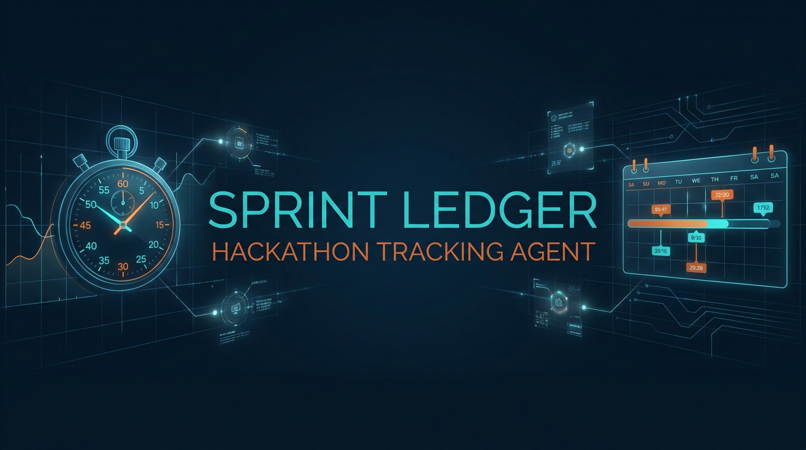
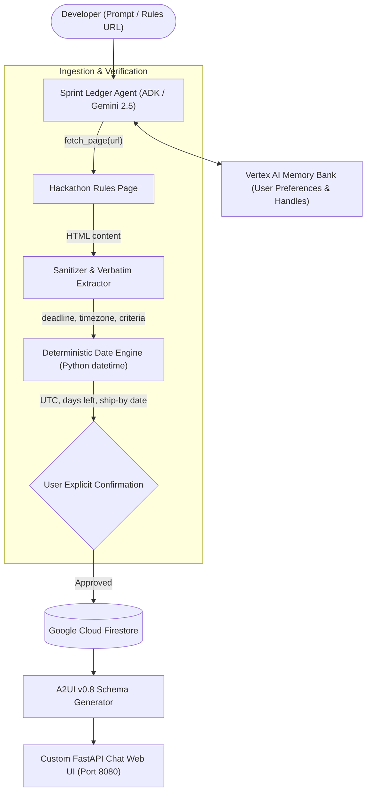

<div align="center">



# ⏱️ Sprint Ledger

### A hackathon tracker agent built with Google Agent Development Kit (ADK), Gemini 2.5 Flash, Firestore, and A2UI.

[](https://python.org)
[](https://cloud.google.com)
[](https://google.github.io/adk-docs/)
[](https://cloud.google.com/firestore)
[](https://a2ui.org)
[](LICENSE)

</div>

---

**Sprint Ledger** helps developers capture, verify, and track hackathon deadlines and submission requirements with deterministic date calculations, Firestore persistence, checklist tracking, and rich A2UI cards.

## 🎬 Live Agent Demo

https://github.com/user-attachments/assets/sprint_ledger_demo.mp4 (or view locally: [`assets/sprint_ledger_demo.mp4`](assets/sprint_ledger_demo.mp4))

<video src="assets/sprint_ledger_demo.mp4" controls="controls" width="100%" style="max-height: 480px; border-radius: 8px;">
  Your browser does not support the video tag. Watch the demo video: <a href="assets/sprint_ledger_demo.mp4">assets/sprint_ledger_demo.mp4</a>
</video>

*Watch Sprint Ledger render live side-by-side dashboard cards, toggle interactive Firestore checklist items, evaluate sprint priority deadlines, and query real-time database records.*

## 🌟 Key Features

- **🌐 Single-Page Rules Ingestion**: `fetch_page(url)` securely grabs rules from hackathon platforms (Devpost, dev.to, AWS Builder, etc.) with strict HTML sanitization and timeout protections.
- **🛡️ Evidence-First Extraction**: Extracts deadline quotes, timezones, and checklist criteria verbatim. Missing items are strictly marked `"NOT FOUND"`—never hallucinated.
- **📐 Deterministic Date Math**: Never lets the LLM perform date math. Python's standard `datetime` and `zoneinfo` parse deadlines, compute UTC timestamps, calculate days remaining, and set a **Ship-By Date** (`deadline - 1 day`).
- **🗄️ Firestore Persistence**: Saves and organizes tracked hackathons and tracks checklist progress.
- **🧠 Cross-Session Memory**: Integrates Vertex AI Memory Bank (`PreloadMemoryTool` & callbacks) to remember developer preferences, handles, and tech stacks across conversations.
- **🎨 A2UI Rich Cards & Custom Frontend**: Renders hackathon countdowns, checklists, and status badges in a branded, responsive web interface.

---

## 🏗️ Architecture & Flow



### Project Structure

```text
sprint-ledger/
├── app/
│   ├── agent.py               # Main ADK agent logic, tools, and callbacks
│   ├── db.py                  # Firestore database client & CRUD operations
│   ├── fast_api_app.py        # FastAPI backend server
│   └── app_utils/             # App utilities and helpers
├── frontend/                  # Custom chat web interface (A2UI & brand styling)
│   ├── static/index.html      # Tailored frontend with live A2UI renderer
│   ├── main.py                # FastAPI proxy server
│   └── requirements.txt
├── tests/                     # Unit and integration tests
├── seed_firestore.py          # Firestore database initialization script
├── agents-cli-manifest.yaml   # Agent metadata and deployment specification
├── pyproject.toml             # Project dependencies (managed with uv)
├── Dockerfile                 # Container image specification
└── README.md
```

---

## 🛠️ Built With

- **Framework**: [Google ADK (Agent Development Kit)](https://google.github.io/adk-docs/) & `agents-cli`
- **Model**: Gemini 2.5 Flash on Vertex AI
- **Database**: Google Cloud Firestore (Native mode)
- **Memory**: Vertex AI Memory Bank
- **UI**: A2UI (Agent-to-User Interface) + Custom FastAPI / Cloud Run frontend

---

## 🚀 Quick Start

### 1. Prerequisites

- Python 3.11+
- [uv](https://docs.astral.sh/uv/getting-started/installation/)
- [agents-cli](https://google.github.io/agents-cli/guide/getting-started/): `uv tool install google-agents-cli`
- [Google Cloud SDK (gcloud)](https://cloud.google.com/sdk/docs/install) authenticated to your project:
  ```bash
  gcloud auth application-default login
  ```

### 2. Install Dependencies

```bash
uv sync
```

### 3. Local Development

Run the agent locally with the ADK playground:
```bash
uv run agents-cli playground
```

Or run the custom web frontend:
```bash
cd frontend
uv run uvicorn main:app --reload --port 8080
```

---

## 🧪 Testing

Run unit and integration tests:
```bash
uv run pytest tests/unit tests/integration
```

---

## 🚢 Deployment

Deploy to Vertex AI Agent Runtime:
```bash
gcloud config set project <your-project-id>
agents-cli deploy
```
